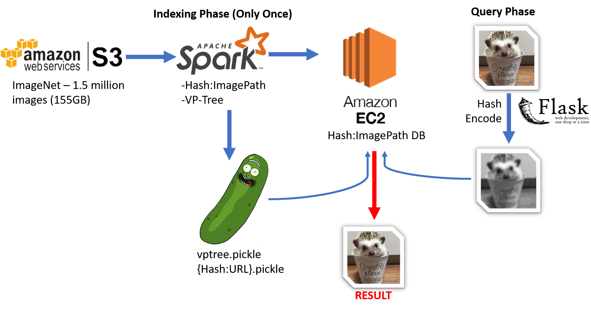

# Picture_Perfect
Employing Data Abstractions in Image Search

 # [Live Demo](http://bigdatageno.me/ "Picture Perfect")

## Background/Problem

- Identifying and retrieving similar images within large databases is computationally intensive
- 32-bit Color Images 
    - Each pixel is represented by three bytes (RGB)
    - Up to 256 possibly values per color channel (16,777,216 possible combinations)
    - Fourth byte is alpha channel depicting transparency
- Image pixel-map contain a lot of noise (e.g. elements in background of image) that make it hard to identify similar elements found in other photos

## Solution

- Performing data abstractions on images over distributed network decreases the complexity of the search space and only essential elements are compared for similarity

- Distributed networks allow the computational work to be split up between nodes to improve the overall speed of the image search

## Business/Use Case
- Functional reverse image search/retreival engine (finds exact copies and near-duplicate images)
- Copyright Infringement
    - Can recognize if photo is stolen and used with permission even if modified

## Tech Stack

- **S3:** Storage
- **Apache Spark:** Distributed Cluster-Computing Framework 
- **Amazon EC2:** Hosts Cluster & Flask Web App
- **ImageNet** ML Image Data Set containing over 1.5 million images (>155GB data)

## Pipeline

## Challenge 1: Data Abstractions

1. Convert all color images in dataset to grayscale and resize to 32x32 pixels
2. Vectorize grayscale images and convert to binary array (using diffHash)
3. Images can be further compressed as integer representation
* Hamming distance can be utilized to rapidly compare the binary representation of two different images

## Challenge 2: Time Complexity

* A pairwise comparison of all images against eachother would be *O*(n)2
* Locality Sensitive Hashing (LSH) and Vantage Point Trees (VP-Trees) can be utlized to improve time-complexity of queries to order of *O*(log(n))

## Challenge 3: Clustering

* Typically VP-Trees alone would work fine at improving time-complexity of the image search engine when queries are *not* performed on distributed networks
* On distributed networks, near-duplicate images or even exact copies may be sent to separate partitions or nodes on the distributed network which would lead to improper clustering
* Locality Sensitive Hashing (LSH) can be employed to 'pre-cluster' images by similarity and repartition the data on the groups of similar images that form
* Then VP-Tree clustering can be performed in parallel on each paratitioned group of similar images to calculate their similarity/distance within each group

## About Me

* My background is in bioinformatics/genomics
* I started in the stem cell domain but overtime gained interest in the computational side of biological research
* Working with genomic data sets led me into an interest in becoming acquainted with the tools and techniques data engineers use to process with large volumes of data
* I am dedicated to my work and passionate about learning but I always try to find time to relax and enjoy my hobbies like playing/writing music and cooking

## Technologies
`Apache Spark`, `AWS S3`, `Locality Sensitive Hashing`, `LSH`, `Vantage Point Tree`, `ImageNet`

## [Presentation Link](http://bit.ly/Vasco_PicturePerfect "Picture Perfect Presentation Slides")
